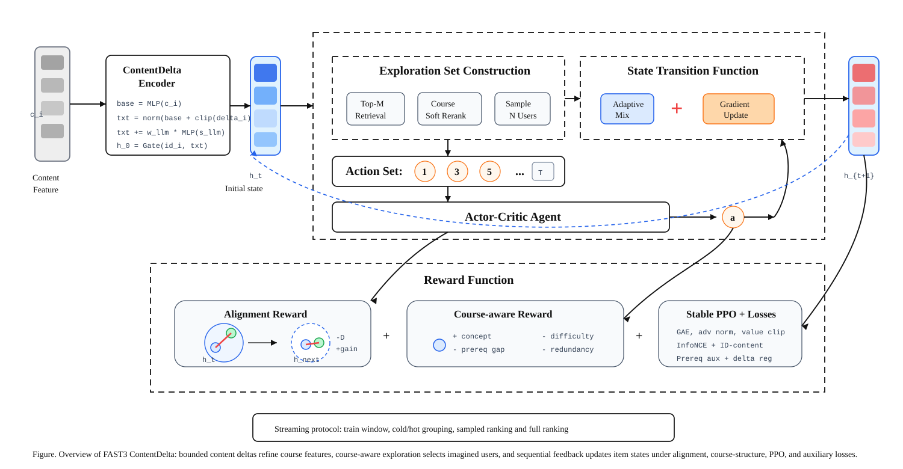
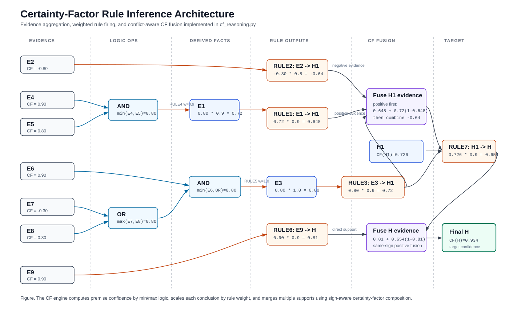
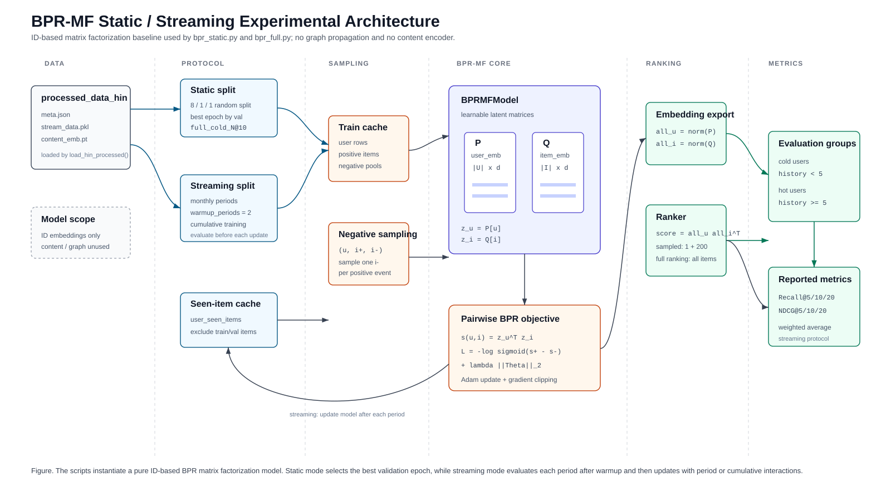

# Model Structure Figures

下面几张图已经按论文/顶会常见风格整理为矢量 SVG，可直接放入技术报告或论文草稿。

## 0. USIM-Feedback FAST3 主模型结构图

对应代码：`usim_feedback_fast3.py`

建议图注：

> 图 X. USIM-Feedback FAST3 模型结构。模型首先融合课程 ID 嵌入、课程内容表征与 LLM 语义反馈，得到面向冷启动场景的课程向量；随后通过检索式候选用户采样和 Actor-Critic 策略模拟多步用户反馈，并引入自适应目标混合、课程概念奖励、先修约束、难度适配与冗余惩罚构造奖励信号。训练阶段联合优化 InfoNCE 排序损失、ID-内容对齐损失、先修辅助损失与稳定 PPO 损失，最终在流式协议下分别评估冷/热用户的 sampled ranking 与 full ranking 指标。

## 1. CF 规则可信度推理结构图

对应代码：`cf_reasoning.py`

建议图注：

> 图 X. 基于确定性因子（Certainty Factor, CF）的规则推理结构。系统首先通过 min/max 逻辑计算复合前提可信度，再按规则权重传播至中间假设，最后采用符号敏感的 CF 合成规则融合正负证据并得到目标假设可信度。

## 2. BPR-MF 静态/流式推荐模型结构图

对应代码：`bpr_static.py`, `bpr_full.py`

建议图注：

> 图 X. BPR-MF 静态与流式实验框架。模型仅使用用户与课程 ID 嵌入，通过正负样本三元组优化 BPR pairwise loss；静态协议采用 8/1/1 划分并按验证集选择最优轮次，流式协议按时间周期先评测后累计更新，并分别报告冷/热用户在 sampled ranking 与 full ranking 下的 Recall/NDCG 指标。
